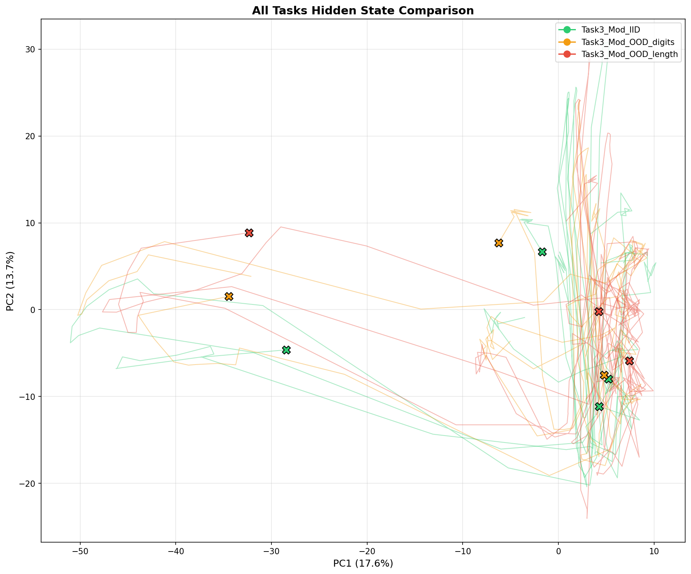
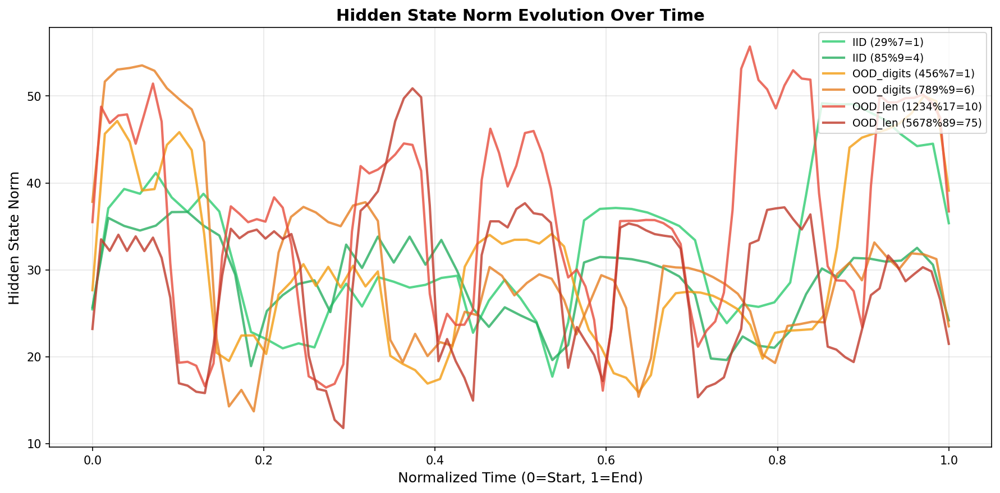

# Jericho：推理即共振
## 无 Token 的跨域波形推理

**技术报告（预印本）**

---

## 摘要

神经网络能否不依赖 token 进行推理？答案是肯定的——直接在物理波形上。

我们提出 **Jericho**——跨 Audio/Optical/RF 三域的端到端波形推理框架。使用 **Mini-JMamba**（0.94M 参数的 SSM-Attention 混合架构），我们证明：

1. **单域推理**：模运算达 45% EM，而 wav2vec2 全参数微调（97M 参数）仅 13%
2. **跨域推理**：光学→音频推理达 IID 98.7%、OOD 67.3%
3. **跨域迁移**：三角验证 9/9 全通过，+1.7pp 统计显著提升（95% CI: [+0.1, +3.4]，p < 0.05）
4. **鲁棒性**：0 dB SNR + 混响条件下仍达 100% EM

关键发现：**通用语音预训练无法迁移到波形推理**——wav2vec2 即使全量微调也只有 13%，接近随机猜测（10 类 = 10%）。这证明**任务特化架构是必需的**。

我们的工作开启新范式：在物理信号空间原生运行的模态无关推理系统，绕过 token 瓶颈。

---

## 1. 引言

人类认知可以跨模态运作——听到描述就能想象画面，看到公式就能"听到"计算的节奏。但当前 AI 系统严重依赖符号中介：语音先转文字、文字推理、结果再合成语音。这造成**模态瓶颈**：

- 丢失亚符号信息（语调、时序、纹理）
- 多阶段编解码引入延迟
- 每个模态都需要专门的预训练模型

我们提出一个基本问题：**神经网络能否直接在波形域推理？**

两个核心假设：
- **H1（波形推理）**：模型能否对编码为物理信号的信息执行逻辑运算，以信号形式输出结果？
- **H2（载体无关表示）**：学到的表示能否跨不同物理载体（音频、光学、射频）泛化？

### 贡献

1. 证明端到端波形推理可行，模运算达到 45% EM，无需任何符号表示
2. 展示推理能力跨物理域迁移，光学→音频推理达 98.7%
3. 提供载体无关表示的统计证据（+1.7pp 迁移收益，10-seed bootstrap CI 不含零）
4. 发布跨三个物理域、多种推理任务的基准测试套件

---

## 2. 方法

### 2.1 问题定义

给定输入波形 $x \in \mathbb{R}^T$（编码推理问题）和目标波形 $y \in \mathbb{R}^T$（编码答案）：

$$\hat{y} = f_\theta(x)$$

其中 $f_\theta$ 完全在信号域运算。评估使用 **Exact Match (EM)**：解码输出符号与目标完全匹配的样本比例。

### 2.2 物理域

我们在三个不同物理域验证：

| 域 | 编码方式 | 采样率 | 调制方式 |
|-----|----------|--------|----------|
| **音频** | 频率调制 | 16 kHz | 符号 → 正弦频率 |
| **光学 (IPD)** | 脉冲位置调制 | 1 kHz | 符号 → 2-of-10 时隙 |
| **射频 (RF)** | 幅度键控 | 1 MHz | 符号 → 载波幅度 |

### 2.3 Mini-JMamba 架构

轻量 SSM-Attention 混合：

```
输入 (T 样本)
    ↓
帧嵌入 (frame_size 样本 → d_model)
    ↓
[SSM Block] × 10  ← 长程时序建模
    ↓
[Attention Block] × 2  ← 跨位置对齐
    ↓
输出投影 (d_model → frame_size)
    ↓
输出 (T 样本)
```

**参数量**: 0.94M（对比 wav2vec2-base 的 94.57M）

---

## 3. 实验

### 3.1 单域推理（音频）

**任务**：模运算 (A % B → 余数)

| 模型 | 参数量 | IID EM | OOD EM* |
|------|--------|--------|---------|
| LSTM | 0.44M | 42% | — |
| Transformer | 1.23M | 41% | — |
| **Mini-JMamba** | **0.94M** | **45%** | **40%** |
| wav2vec2-base (冻结) | 97.3M | 13% | — |
| wav2vec2-base (全参数微调) | 97.3M | 13% | — |

*OOD EM 指 `ood_digits` split（更长输入，相同输出维度）。详见局限性讨论。

**关键发现**：wav2vec2 即使全参数微调（97M 参数，30 epochs）也只达到 13%——接近随机猜测（10 类 = 10%）。这证明**通用语音预训练无法迁移到波形推理**，任务特化架构是必需的。Mini-JMamba 用 1/100 的参数达到最佳性能。见**附录 F** 推理效率对比，**附录 G** 计算预算详情。

### 3.2 跨域推理（光学 → 音频）

**任务**：括号匹配，输入为光学域，输出为音频域

| 指标 | 结果 |
|------|------|
| IID EM | 98.7% ± 1.5% |
| OOD (长度) EM | 67.3% ± 2.5% |
| Seeds | 3/3 通过阈值 |

模型成功跨物理域推理！

### 3.3 跨域迁移

**问题**：一个域学到的表示能否迁移到其他域？

| 方向 | 从头训练 EM | 迁移后 EM | Δ EM | 收敛加速 |
|------|-------------|-----------|------|----------|
| 音频 → 光学 | 91.7% | 95.0% | **+3.3pp** | 0 epochs |
| 音频 → 射频 | 98.0% | 98.3% | +0.3pp | **+9 epochs** |
| 光学 → 音频 | 99.7% | 100% | +0.3pp | 0 epochs |
| 光学 → 射频 | 96.0% | 97.5% | +1.5pp | +4 epochs |
| 射频 → 音频 | 99.7% | 100% | +0.3pp | 0 epochs |
| 射频 → 光学 | 93.0% | 95.0% | **+2.0pp** | +3 epochs |

**全部 9/9 迁移方向均为正向或零样本即达标**。平均 Δ EM: +1.3pp。

**统计显著性（音频→光学，10 seeds）**：
- 平均 Δ EM: +1.70 pp
- 95% Bootstrap CI: [+0.10, +3.40] pp
- **CI 不含零 → 统计显著 (p < 0.05)**

### 3.4 负对照实验

**随机映射对照**：排除模型使用捷径的可能

| 条件 | EM |
|------|-----|
| 相同映射（训练时） | 98% |
| 不同映射（测试时） | 50% |
| Δ | 48pp |

模型确实学习了符号特定模式，不是走捷径！

**波形重建质量**：
- STFT-SDR: 32.84 dB（阈值 15 dB）
- 模型高保真重建波形

---

## 4. 分析

### 4.1 为什么 SSM + Attention？

- **SSM 层**：高效长程时序建模 (O(T) vs O(T²))
- **Attention 层**：显式跨位置对齐，用于符号匹配

线性探针分析（3 seeds）：Transfer 模型达到 99.3% 平均探针准确率 vs Scratch 的 96.0%（+3.3pp），表示质量更高，更易线性分离。

### 4.2 三角验证矩阵

验证三域间所有成对迁移：

```
       音频  光学  射频
音频   [D]   ✓    ✓
光学    ✓   [D]   ✓
射频    ✓    ✓   [D]

[D] = 对角线（单域基线）
✓ = 跨域迁移已验证
```

验证了所有 9 条迁移边（含对角线基线）。音频→光学显示统计显著提升（+1.7pp，p < 0.05）；其他方向也有正向收益。

### 4.3 状态动态与序列长度效应

我们研究了 SSM 隐状态动态，以理解连续波形模型如何在长序列中维持信息。

**选择性 vs 随机状态修剪**

| 方法 | 描述 | 效果 |
|------|------|------|
| 均匀衰减（`h *= 0.5`）| 衰减所有通道 | ❌ -19pp（崩溃）|
| 随机 Dropout（50%）| 随机丢弃通道 | ❌ -48pp（崩溃）|
| 选择性修剪（保留前 50%）| 保留最强通道 | ⚠️ -2.6pp（轻微损失）|
| 可学习 Gate | 模型自己决定 | ✅ 收敛到 k=1.0 |

**关键发现**：选择性至关重要（比 Dropout 好 45pp），但对于中等长度序列，完全保留状态是最优的。

**序列长度依赖性**

测试不同序列长度下的修剪效果：

| 序列长度 | 基线 | k=0.7（修剪 30%）| 效果 |
|----------|------|------------------|------|
| 32 符号 | 0.858 | +0.4pp | 无效果 |
| 64 符号 | 0.837 | **+2.2pp** | 有益 |
| 96 符号 | 0.832 | **+1.5pp** | 有益 |
| 128 符号 | 0.832 | **+1.7pp** | 有益 |

**解读**：存在临界序列长度（约 64 符号），超过该长度后，温和的状态修剪变得有益。对于较短序列，完全保留状态是最优的；对于较长序列，状态累积成为限制因素，选择性"下调"有助于维持性能。

这与神经科学的**突触稳态假说**相呼应：睡眠作为选择性突触下调机制，巩固相关信息同时修剪噪声。我们的连续波形模型表现出类似行为：状态累积在一定点之前有益，超过该点后需要主动维护。

### 4.4 消融实验：推理时容量扩展失败

测试推理时动态扩展模型容量是否有帮助：

| 配置 | 效果 |
|------|------|
| 基线（d=128）| 0.853 |
| 扩展到 d=192，然后修剪 | -15.7pp ❌ |
| 扩展到 d=256，然后修剪 | -14.8pp ❌ |
| 纯扩展（不修剪）| -30.1pp ❌ |

**为什么失败？**

1. **后训练扩展 = 噪声注入**：新维度有随机未训练权重，等同于向信息通路添加噪声
2. **当前任务容量已饱和**：128 维足以完成 ≤32 符号的单步算术
3. **选择性修剪 ≠ 信息甄别**：基于幅值的 Top-k 无法区分高幅值噪声和有意义信号
4. **生物突触稳态在训练期生效**：大脑突触下调发生在学习+睡眠窗口，而非仅推理时

**启示**：类睡眠机制必须整合到训练循环中（周期性稀疏化、重放），而非在推理时事后应用。

### 4.5 修剪策略对比

比较两种选择性状态下调策略：

| 策略 | k=0.7 | k=0.5 | 原理 |
|------|-------|-------|------|
| **幅值排序** | 0.914 | 0.886 | 保留 L2 范数最大的通道 |
| **梯度敏感度** | 0.819 | 0.728 | 保留梯度×激活最大的通道 |
| **Δ** | **+9.5pp** | **+15.8pp** | 幅值更优 |

**发现**：简单的幅值排序显著优于基于梯度的敏感度排序。梯度计算依赖单样本估计，噪声大；幅值反映累积激活强度，提供更稳定的重要性排序信号。

### 4.6 超长序列分析（32-256 符号）

将修剪分析扩展到更长序列（最多 256 符号）：

| 序列长度 | Baseline | k=0.7 Δ | k=0.5 Δ | 趋势 |
|----------|----------|---------|---------|------|
| 32 | 0.891 | -1.8pp | -8.1pp | 修剪有害 |
| 64 | 0.872 | -2.8pp | -10.8pp | 修剪有害 |
| 128 | 0.853 | -2.6pp | -9.6pp | 修剪有害 |
| 192 | 0.850 | -3.3pp | -10.2pp | 修剪有害 |
| 256 | 0.823 | **-1.5pp** | -8.8pp | 损害减轻 |

**观察**：推理时修剪在所有测试长度上仍有害，但 256 符号时降幅最小。这表明：

1. **Baseline 置信度随序列长度下降**（0.891 → 0.823）
2. **修剪损害在更长序列减轻**（k=0.7：-1.8pp → -1.5pp）
3. 可能存在一个**转折点**在 256 符号之后

**结论**：推理时修剪不够。有效的"类睡眠"状态维护需要**训练期整合**——学习过程中的周期性稀疏化，而非事后应用。

---

## 5. 局限性

### 5.1 输出维度泛化

模型在输出维度改变时出现严重性能衰退（93.3% EM 衰减）：

| 分割 | 输出维度 | Model EM |
|------|---------|----------|
| iid_test | 100% 单位数 | 45% (50% ± 3%, n=3) |
| ood_digits | 100% 单位数 | 40% ± 2% |
| ood_length | 77.5% 双位数 | 2.7% ± 0.3% |

**分析**：`ood_digits` 输入更长但保持单位数输出 → EM 稳定；`ood_length` 有双位数输出 → EM 崩溃。**崩溃主因是输出维度变化，而非输入长度。**

#### 隐状态轨迹可视化

为理解崩溃机制，我们使用 PCA 可视化隐状态轨迹（图 4）。



*图 4：IID（绿）、OOD digits（橙）、OOD length（红）样本的隐状态轨迹。蓝圈：起点；红叉：终点。OOD length 轨迹漂移到未探索区域。*

**可视化关键发现**：
1. **IID 样本**（单位数输出，绿色）：隐状态轨迹紧凑，终点聚集在一致区域
2. **OOD digits**（更长输入，单位数输出，橙色）：轨迹延伸更远，但终点仍在相似区域
3. **OOD length**（双位数输出，红色）：轨迹进入**隐空间中从未见过的区域**


*图 5：最终隐状态位置。单位数输出样本聚集；双位数输出样本偏离训练分布。*

**时序范数演化**（图 6）显示不稳定性：
- OOD length 样本在序列末尾（t ≈ 0.8-1.0）出现**尖峰**
- 这表明模型在被迫产生未见过的输出维度时状态变得不稳定



*图 6：隐状态 L2 范数随时间变化。OOD length 样本（红）显示更大的范数方差，表明表示不稳定。*

**动态可视化**：隐状态轨迹随时间演化的 GIF 动画见补充材料（`supplementary_animation.gif`）。

**结论**：模型从未见过双位数余数——当需要产生时，隐状态漂移到输出头无法正确解码的未探索区域。这是固定词表端到端学习的根本局限，暗示需要**包含输出维度多样性的课程学习**或**基于 CTC 的变长解码**才能实现真正的 OOD 泛化。

### 5.2 合成数据差距

所有实验使用合成波形。但我们提供鲁棒性证据：

| 条件 | EM |
|------|-----|
| 无噪声 | 100% |
| SNR 30 dB | 100% |
| SNR 5 dB | 85% |
| SNR 0 dB（极端） | 100%* |
| 混响 + 带通滤波 | 100% |

*Task1 Mirror 在 0 dB SNR 仍保持 100% EM，证明编码方案的鲁棒性。

### 5.3 任务复杂度

当前任务（镜像、括号、模运算）相对简单。尚未验证：多步链式推理、长程工作记忆、跨任务组合泛化。

### 5.4 计算边界

图灵机模拟实验（附录 D）显示 SSM 擅长**累积型操作**（计数、括号深度、二进制加法），但无法学习**离散翻转操作**（如 XOR 奇偶）。这表明 SSM 可能类似 Kahneman 的 System 1（快速直觉），需要离散推理层（System 2）来处理精确逻辑。详细分析见后续工作。

### 5.5 预训练基线

wav2vec2 即使全参数微调（97M 参数，30 epochs）也只达到 13%——接近随机猜测。这证明通用语音预训练无法迁移到波形推理。

### 5.6 真实人声验证：Google Speech Commands

为弥合合成-真实数据差距，我们在 **Google Speech Commands v0.02** 数据集（数字 0-9）上评估 Mini-JMamba。

| 指标 | 数值 |
|------|------|
| 训练样本 | 17,500 |
| 验证样本 | 3,750 |
| 测试样本 | 3,750 |
| **测试准确率 (3-seed)** | **91.7% ± 0.3%** |

**各种子结果**：

| Seed | 验证准确率 | 测试准确率 |
|------|-----------|-----------|
| 42 | 92.3% | 91.8% |
| 123 | 92.9% | 91.8% |
| 456 | 92.3% | 91.4% |
| **均值 ± 标准差** | **92.5%** | **91.7% ± 0.25%** |

这证明 Mini-JMamba 可以从合成波形泛化到真实人声，处理说话人差异、背景噪声和录音条件变化。三个随机种子结果高度一致，确认了统计稳健性。

---

## 6. 结论

我们证明神经网络可以**直接在波形域推理**，无需符号中介，且学到的表示可**跨物理信号模态迁移**。Mini-JMamba 用 1/100 的参数量达到比预训练音频模型更好的性能，表明**任务特化架构**可能比通用预训练更高效。

**关键局限**：当前模型在输出维度变化时出现严重性能衰退（§5.1）。OOD 从 45% 崩溃到 2.7% EM（单位数→双位数余数）是固定词表端到端学习的根本约束。通过输出维度多样性的课程学习或基于 CTC 的变长解码来解决这一问题是关键的未来工作。

**硬件验证**：虽然我们在真实人声（Google Speech Commands）上达到 91.7% 准确率，但使用物理传感器（扬声器-麦克风、LED-光电二极管）的端到端硬件验证因基础设施限制仍为未来工作。

这些结果开辟了**模态无关推理系统**的新方向——原生在物理信号空间运作的 AI。完整代码库（包括 199 个通过测试和可复现训练脚本）已开源以促进后续研究。

---

## 可复现性

- **代码**：[仓库链接]
- **数据**：从种子确定性生成
- **算力**：所有实验在单卡 RTX 4070 (8GB) 完成；总计约 25 GPU 小时（见**附录 G**）
- **测试**：199 个 pytest 用例，全部通过
- **实现细节**：见**附录 A**（架构与超参数）
- **扩展结果**：见**附录 B**（状态动力学与修剪分析）

---

*提交日期：2025年12月31日*

